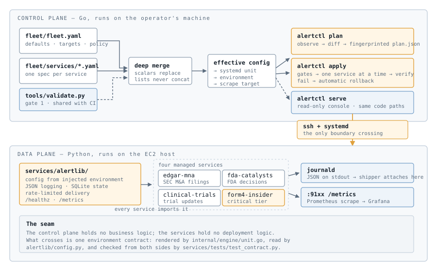
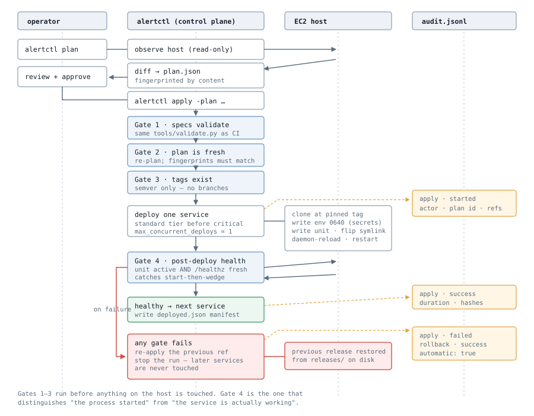
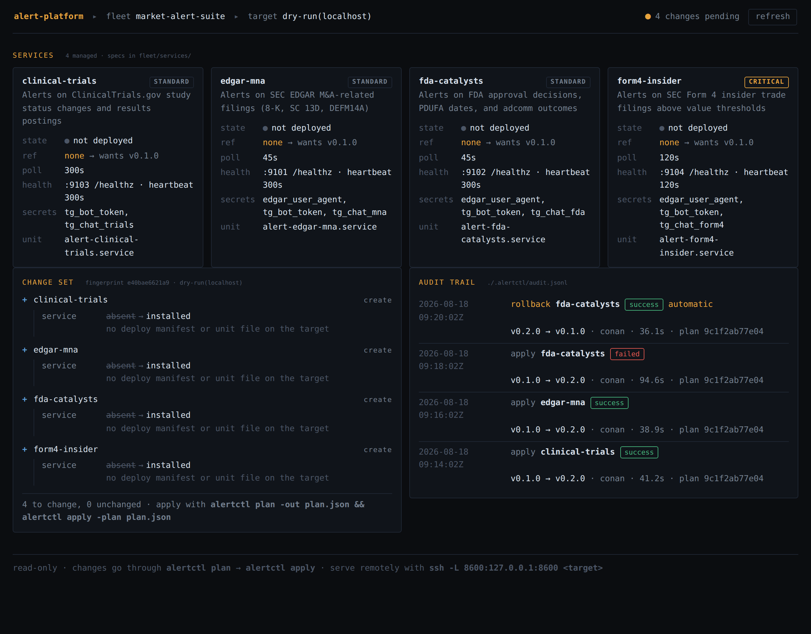

# alert-platform

Four Python alerting services — SEC EDGAR M&A filings, FDA catalysts,
ClinicalTrials.gov updates, Form 4 insider trades — used to be hand-operated
on a single EC2 box: `git pull`, edit a unit file, `systemctl restart`, watch
`journalctl` for a minute, hope. Config lived in `.env` files that only
matched the running process by accident. There was no record of what changed,
no way to tell whether the box still matched the repo, and rolling back meant
remembering what the previous version was.

This repo is the platform layer that replaced that. Specs declare desired
state; `alertctl` reconciles it — planned first, gated before and after,
audited, and rolled back automatically when a deploy fails to come up healthy.

## What changed

| | Before | After |
|---|---|---|
| Deploy | ~8 manual steps per service, from memory | `alertctl plan` → review → `alertctl apply` |
| Config | `.env` files, drifting from the repo | one versioned spec per service, schema-validated |
| Secrets | committed to git | referenced by name, resolved on the host at deploy time |
| Verification | tail the logs and hope | unit must be `active` **and** `/healthz` heartbeat fresh |
| Failure | notice it later, fix by hand | automatic rollback to the previous tag, run stops |
| History | shell history, if that | append-only audit log: who, what, from→to, outcome |
| Drift | invisible | `alertctl drift` exits non-zero |

## What it refuses to do

The parts worth reviewing are the refusals, not the happy path:

- **Apply a stale plan.** Plans are fingerprinted by content; `apply` re-plans
  and compares before touching anything. A plan reviewed on Monday cannot be
  applied on Friday against edited specs.
- **Deploy a branch.** `spec.source.ref` must be a semver tag — schema-enforced,
  and re-checked at the point it reaches `git`. A deploy of `main` is not
  reproducible, so it is not a legal desired state.
- **Accept a secret value in a spec.** The schema constrains secret fields to
  name patterns, and the validator scans every string in every file for
  credential-shaped values as a second net.
- **Call a deploy successful because the process started.** The post-deploy
  gate requires a fresh heartbeat from `/healthz`, which is what catches a
  service that starts and then wedges.
- **Mutate the host during `--dry-run`.** A command qualifies as read-only
  only if it starts with a known-safe verb *and* contains no chaining and no
  privilege escalation — `test -d X || sudo git clone ...` does not qualify.
- **Change anything from the web console.** It is read-only by construction.

## The deploy lifecycle

Gates 1–3 run before the host is touched at all. Gate 4 is the one that
distinguishes "the process started" from "the service is actually working".
Standard-tier services deploy before critical-tier ones, one at a time: if a
shared change is going to break something, it should break `clinical-trials`
while the gate can still stop the rollout.

## The operator console

`alertctl serve` puts a read-only view on the same engine the CLI drives —
fleet overview, the live change set, and the audit trail on one page.

It has no data model of its own: every panel calls `fleet.Load`,
`engine.Observe`, `engine.BuildPlan` or `audit.History`. There is nothing to
keep in sync, and no write path — changes go through `plan` → review →
`apply`, where the gates and the audit record live. It binds to loopback;
reach a remote target the way the platform already does:

    ssh -L 8600:127.0.0.1:8600 ec2-alerts-prod

## Layout

    fleet/fleet.yaml          fleet-wide defaults, targets, change policy
    fleet/services/*.yaml     one desired-state spec per managed service
    schema/                   JSON Schema for spec validation
    tools/validate.py         schema + fleet-invariant validator
    tools/gen_observability.py  Prometheus/Grafana config, generated from specs

    cmd/alertctl/             the control-plane CLI
    internal/fleet/           spec loading, deep merge, effective config
    internal/engine/          plan, apply, gates, unit rendering, secrets
    internal/audit/           append-only deploy log
    internal/exec/            ssh / local / dry-run command execution
    internal/console/         read-only operator console

    services/alertlib/        shared runtime: config, logging, state, delivery, health
    services/<name>/main.py   the four services, at the paths their specs declare
    services/tests/           unit, bootstrap, and cross-language contract tests

    deploy/                   generated scrape targets, alert rules, dashboard
    docs/                     spec rationale, architecture, migration, runbooks

## Quick start

    make deps
    make check                # lint + validate + both test suites + generated config
    make build                # bin/alertctl

    ./bin/alertctl plan -out plan.json
    ./bin/alertctl apply -plan plan.json
    ./bin/alertctl serve      # http://127.0.0.1:8600

`make check` is exactly what CI runs. `tools/validate.py` is also the first
gate of every deploy, so a spec that validates locally will not be rejected at
apply time.

To see the whole flow without a host, `-target dry` records every command
instead of executing it.

## Commands

| Command | Does |
|---|---|
| `alertctl validate` | schema + fleet invariants |
| `alertctl plan` | diff desired against observed, fingerprinted |
| `alertctl apply` | reconcile, with gates, audit, and auto-rollback |
| `alertctl status` | what is deployed, and is it running |
| `alertctl drift` | non-zero exit if the host no longer matches the specs |
| `alertctl rollback` | rewrite a spec to its last successful ref |
| `alertctl render` | print the unit and env a service would get |
| `alertctl history` | read the audit log |
| `alertctl serve` | read-only operator console |

`render` is safe to share: secrets appear as `<resolved-at-apply>`.

## Tests

Both planes are tested, and so is the seam between them:

| Suite | Covers |
|---|---|
| `internal/fleet` | merge semantics, effective config, typed accessors |
| `internal/engine` | unit/env rendering, planning, fingerprinting, **failed deploy → automatic rollback → audit** |
| `internal/exec` | the dry-run read-only guarantee |
| `internal/audit` | append-only, corruption tolerance, rollback ref selection |
| `internal/console` | read-only enforcement, spec-only rendering, API shape |
| `services/tests` | alertlib units, service bootstrap, **cross-language env contract** |

The rollback test drives the real `Apply` loop — pre-flight gates included —
against a temporary git repo and a runner that fails one command, then asserts
the service was returned to its previous ref and that both the failure and the
rollback reached the audit log. It is the platform's central claim, executable.

Linting is `golangci-lint` (errcheck, staticcheck, gosec, bodyclose and
others) and `ruff`; both run in CI alongside a `gofmt` check.

## Docs

- [Architecture](docs/architecture.md) — the two planes, the environment
  contract, host layout, failure modes, portability, log shipping
- [Spec design](docs/spec.md) — the six decisions that constrain every phase
- [Migration record](docs/migration.md) — what moved, what the specs got wrong,
  and what to do before the first deploy

## Runbooks

- [Deploy a change](docs/runbooks/deploy.md)
- [Roll back a service](docs/runbooks/rollback.md)
- [A service is down or silent](docs/runbooks/service-down.md)
- [Rotate a secret](docs/runbooks/secret-rotation.md)
- [Run a service locally](docs/runbooks/local-development.md)

## Status

- [x] Phase 1 — declarative fleet spec + validation
- [x] Phase 1.5 — migrate services onto the platform runtime ([`docs/migration.md`](docs/migration.md))
- [x] Phase 2 — plan/apply deploy workflow with audit log (Go CLI)
- [x] Phase 3 — pre/post-deploy validation gates
- [x] Phase 4 — versioned rollback tooling
- [x] Phase 5 — Prometheus metrics + Grafana dashboards
- [x] Phase 6 — runbooks, drift detection, architecture docs
- [x] Phase 7 — read-only operator console

Phases 2–7 are implemented and tested, but have not yet run against the
production host. Before the first deploy, work through
[**docs/migration.md → Before the first deploy**](docs/migration.md#before-the-first-deploy):
rotate the leaked Telegram token, populate SSM, cut the `v0.1.0` tag, prepare
the host, and migrate existing SQLite state.

Outstanding beyond that: `dedup.keys` is declared but not yet consumed by the
services, and `state.backup` is declared with no backup job behind it.
