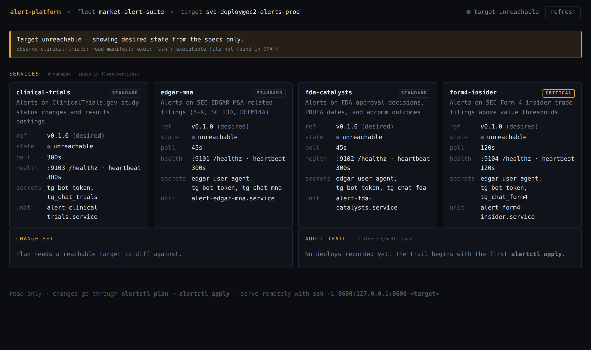

# Architecture

How the pieces fit, and why the seams are where they are.

## Two planes

Same diagram as text

    ┌──────────────────────────── control plane (Go) ──────────────────────────┐
    │                                                                          │
    │   fleet/fleet.yaml ─┐                                                     │
    │                     ├─> deep merge ─> effective config ─┬─> systemd unit  │
    │   fleet/services/*.yaml                                 └─> environment   │
    │                     │                                                     │
    │                     └─> tools/validate.py  (gate 1, shared with CI)       │
    │                                                                          │
    │   alertctl plan ──> observe host ──> diff ──> plan.json (fingerprinted)   │
    │   alertctl apply ─> gates ─> deploy ─> post-deploy gate ─> audit / rollback│
    └──────────────────────────────────────────────────────────────────────────┘
                                      │
                                      │  ssh + systemd
                                      ▼
    ┌───────────────────────────── data plane (Python) ────────────────────────┐
    │                                                                          │
    │   services/alertlib/   config · logging · state · delivery · health       │
    │        ▲        ▲          ▲            ▲                                 │
    │        │        │          │            │                                 │
    │   clinical_trials  edgar_mna  fda_catalysts  form4_insider                │
    │                                                                          │
    │   stdout (JSON) ─> journald        :91xx /healthz  /metrics               │
    └──────────────────────────────────────────────────────────────────────────┘

The control plane never contains business logic and the data plane never
contains deployment logic. The only thing crossing the boundary is an
environment contract, documented in `services/alertlib/config.py` and
rendered by `internal/engine/unit.go` — and tested from both sides by
`services/tests/test_contract.py`, because a contract nobody checks is a
comment.

## The environment contract

`alertctl` resolves the effective config, renders `/etc/alert-platform/<svc>.env`
(0640, root:svc-alerts), and systemd hands it to the process. The service
reads it through `Service.from_env()` and reads nothing else — no config
file, no `.env`, no hardcoded path.

| Source in the spec | Environment variable | Read by |
|---|---|---|
| `metadata.name` | `ALERT_SERVICE_NAME` | logging labels, state dir |
| `polling.interval_sec` | `ALERT_POLL_INTERVAL_SEC` | poll loop |
| `polling.<other>` | `ALERT_POLLING_<KEY>` | service-specific behaviour |
| `health.metrics.port` | `ALERT_METRICS_PORT` | health server |
| `health.heartbeat_interval_sec` | `ALERT_HEARTBEAT_INTERVAL_SEC` | liveness |
| `state.dir` + name | `ALERT_STATE_DIR` | SQLite location |
| `delivery.rate_limit_per_min` | `ALERT_RATE_LIMIT_PER_MIN` | Telegram bucket |
| `*_secret: <name>` | `ALERT_SECRET_<NAME>` | resolved value |
| `source.ref` | `ALERT_DEPLOYED_REF` | log and metric labels |

Adding a field is a three-line change: schema, `RenderEnv`, `ServiceConfig`.
The contract test then fails until all three agree, which is the point.

## Host layout

    /opt/alert-platform/<service>/
        releases/v0.1.0/          full repo checkout at the pinned tag
        releases/v0.1.1/          previous releases (3 kept)
        current -> releases/...   atomic symlink; WorkingDirectory
        deployed.json             manifest: ref, hashes, who, when, plan id
    /etc/alert-platform/<service>.env      resolved secrets, 0640
    /etc/systemd/system/alert-<service>.service
    /var/lib/alert-platform/<service>/     SQLite state, backed up
    /var/log/alert-platform/audit.jsonl    append-only deploy history

`current` is flipped with `ln -sfn` + `mv -Tf` so a restart can never observe
a half-swapped tree. Releases are pruned to three: enough to roll back
through a bad day, few enough not to fill the volume, and older tags are
always re-fetchable from the repo.

## Deploy lifecycle

1. **`plan`** — validate, resolve effective config, read `deployed.json` and
   `systemctl show` from the host, diff, fingerprint the result.
2. **Gate: validation** — `tools/validate.py`, the same command CI runs.
3. **Gate: freshness** — re-plan and compare fingerprints. A plan approved
   against different desired state is refused rather than applied.
4. **Gate: tag exists** — `git rev-parse` the ref before anything is touched.
5. **Deploy, one service at a time** — fetch tag, build venv, write env,
   write unit, flip `current`, `daemon-reload`, restart.
6. **Gate: post-deploy** — wait `startup_grace_sec`, require `active`, then
   poll `/healthz` until the heartbeat is fresh. A process that starts and
   then wedges fails this gate; a plain `systemctl` check would not notice.
7. **Audit** — one JSONL entry per service: actor, target, from/to ref,
   hashes, secret *names*, outcome, duration.
8. **Rollback on failure** — re-apply the previous ref, itself audited.

Standard-tier services deploy before critical-tier ones. If a shared change
is going to break something, it should break `clinical-trials` while the gate
can still stop the rollout, not `form4-insider`.

## Why rollback is boring

`source.ref` must be a semver tag (schema-enforced), so the previous spec
fully determines the previous code. Rollback is therefore an ordinary apply
of a different ref — same gates, same audit, same code path. There is no
rollback engine to be wrong, which is exactly what you want from the thing
that runs when everything else has already gone wrong.

`alertctl rollback` deliberately rewrites the spec rather than deploying
behind the repo's back. A rollback that skipped the spec would leave the repo
claiming a version that is not running, and the next apply would silently
roll forward again — reintroducing the outage.

## Failure modes and where they surface

| Failure | Detected by | Response |
|---|---|---|
| Bad spec | `validate` (local, CI, gate) | deploy refused |
| Missing tag | pre-flight `git rev-parse` | deploy refused |
| Stale plan | fingerprint mismatch | deploy refused |
| Missing secret | resolver, before restart | deploy refused |
| Service crash loop | post-deploy gate (`is-active`) | auto-rollback |
| Process up, loop wedged | post-deploy gate (`/healthz` 503) | auto-rollback |
| Manual edit on the host | `alertctl drift` | exit 3, alert |
| Upstream 502 in steady state | `alert_poll_errors_total` | dashboard, no page |
| Telegram rejecting sends | `AlertDeliveryFailing` rule | page |

The distinction in the last two rows is the one worth keeping: a polling
service that sees an upstream error is doing its job; a service that cannot
deliver is silently useless, which is worse than being obviously down.

## The operator console

`alertctl serve` puts a read-only web view on the same engine the CLI drives.

It exists to answer the question a terminal answers badly — *what is the state
of the whole fleet right now* — and it is built under two constraints:

- **No second source of truth.** Every panel calls `fleet.Load`,
  `engine.Observe`, `engine.BuildPlan` or `audit.History`. There is no
  console-specific data model and nothing to keep in sync; if the console and
  the CLI ever disagree, one of them has a bug, which is a better failure mode
  than a cache that is quietly wrong.
- **No write path.** Non-`GET` methods are refused at the boundary, and no
  handler reaches mutating code. Changes go through `plan` → review →
  `apply`, where the confirmation prompt, the gates and the audit record
  live. A browser button that deploys would have to reproduce all of that, or
  quietly skip it.

It degrades in the direction that keeps it honest. Desired state comes from
the specs and renders with no target at all; observed state appears when the
host is reachable and turns into an explicit banner when it is not. The
console never draws a healthy-looking fleet it cannot see:

Note what the panels say rather than show. "Plan needs a reachable target to
diff against" is a different statement from an empty diff, and an empty audit
trail says where entries will come from. A dashboard that renders blank on
failure is indistinguishable from one reporting that nothing is wrong.

It binds to loopback and has no authentication, which is deliberate — for a
remote target, forward it over the transport the platform already trusts:

    ssh -L 8600:127.0.0.1:8600 ec2-alerts-prod

## Portability: what the platform actually assumes

The platform targets systemd over SSH and nothing narrower. It shells out to
`systemctl`, `journalctl`, `install`, `git` and `curl`; it writes unit files
to `/etc/systemd/system` and reads `systemctl show`. Nothing in the control
plane is Debian- or Ubuntu-specific: there are no `apt` calls, no
distribution-specific paths, and no assumptions about the init system beyond
systemd itself.

Moving the fleet to RHEL, or onto KVM guests rather than EC2 instances, is
therefore a change to `targets` in `fleet.yaml` and to
`defaults.runtime.interpreter` — not a change to the engine. The one thing
that would need attention is SELinux: RHEL enforces contexts on files under
`/etc/systemd/system` and `/opt`, so the unit and env writes would need
`restorecon` (or correct contexts at install time) added to the deploy steps.
That is a known, bounded addition to `applyService`, and it is called out here
rather than discovered later.

Virtualization is deliberately outside the platform's scope. `targets` names
hosts; how those hosts come to exist — EC2, KVM, bare metal — is a layer
below, and the platform is better for not having an opinion about it.

## Log and metric shipping

Services log JSON to stdout and systemd routes it to journald. That choice was
made with shipping in mind: journald is a single, structured, queryable source
that every log shipper already knows how to read, so attaching one is a host
concern rather than a service change.

Concretely, a Splunk universal forwarder or a Humio/Falcon LogScale shipper
reads the journal directly (or `journalctl -o json` piped to it) and gets
per-service structured fields — `service`, `level`, `event`, `ref` — without
any service being rebuilt, redeployed, or even restarted. The same is true in
reverse: the platform does not need to know which shipper is in use.

Metrics take the other path. Each service exposes `/metrics` on a port its own
spec declares, `tools/gen_observability.py` derives the scrape targets and
alert rules from those specs, and CI fails if the generated config has drifted
from them. Swapping Prometheus for another scraper means changing the
generator, not the services.

### Source health is its own signal

A poll cycle can complete successfully while one of the sources it polls is
permanently broken, so the cycle counters cannot see the condition that matters
most to alert quality: a feed that stopped answering. `fda-catalysts` ran that
way from August to 2026-09-22 with two feeds returning 403 every cycle.

`alertlib.SourceHealth` keeps per-source outcome counts and the length of the
current failing run, and decides when a repeated failure is worth a log line:
the first, then at widening intervals, then once when the source is presumed
dead, then once on recovery. It exposes `alert_source_fetches_total`,
`alert_source_fetch_failures_total`, `alert_sources_failing` and
`alert_sources_presumed_dead`.

The logging schedule is not cosmetic. An unconditional warning per failed fetch
costs about 1,900 lines per source per day at a 45-second cadence, and the
`logs` read verb captures roughly the first 24 KB of its window — so source
spam displaces the alert output an operator opened the log to read.

### The candidate funnel

Source health answers "is the feed answering". It does not answer the question
`clinical-trials` raised: the feed answers, the service examines hundreds of
candidates a cycle, and nothing comes out. Only the two ends of that pipeline
were recorded, so a filter that is too tight, an upstream query returning the
same rows every cycle, and a transition observed one cycle too late all
produced identical output.

`alertlib.CycleFunnel` records the middle. A service declares the stages its
candidates pass through, counts each one during a cycle, and emits one line per
cycle naming every stage; each stage is also an `alert_funnel_<stage>_total`
counter on `/metrics`. Counting against an undeclared stage raises, because a
funnel that grows a stage on a typo renders a line that looks like a
measurement and is not one.

`alert_funnel_new_in_window` is the part that needs explaining. It compares
this cycle's candidate ids against the previous cycle's, which is the direct
test of a stuck upstream query. "New to our database" does not test it: a
candidate can be long known and still be a fresh arrival in the polling window.
Before any comparison exists the line reports `?` rather than `0`, since zero is
a real answer a later cycle can give.

`clinical-trials` is the first adopter, with `first_sight_completed` as a stage
chosen to test one specific explanation — see
[ADR 0006](adr/0006-candidate-funnel.md). The other three services can adopt it
by declaring their own stages; nothing in the class is specific to trials.

### The alert archive

Every alert is recorded before it is sent and settled with its delivery
outcome afterwards, in an append-only SQLite table in the service's own state
directory (`<state_dir>/alerts.db`). The row holds the service, the released
ref, the upstream source, the service's dedup key, the ticker, the reason the
filter fired, the message as sent, a JSON payload of structured detail, and
whether delivery succeeded.

This is what makes signal quality measurable. A journald line holds rendered
prose and rotates; a row holds the fields an analysis groups by and does not.
It is also what the operator console and the public site will read.

The archive is a separate database from the service's dedup state, and a
failed archive write is logged and counted rather than raised — the reasoning
for both, and why they point in opposite directions, is in
[ADR 0005](adr/0005-alert-archive.md). It exposes
`alert_archive_records_total` and `alert_archive_write_failures_total`.

Services reach it through `Service.send_alert`, not by calling the archive and
the Telegram client in sequence, so "every alert is recorded" is a property of
the send path rather than a convention four services have to remember.

## What is still deliberately absent

- **Multi-host scheduling.** `targets` models one EC2 host. The shape leaves
  room; nothing pretends to be a scheduler.
- **A queue between detection and delivery.** Alerts are sent inline. At this
  volume a queue would add a failure mode without removing one.
- **Config templating.** Four services do not justify a template layer, and
  the reviewability of a plain YAML diff is a feature.
- **Secrets in the control plane.** Values are resolved on the host, by the
  host's own instance role. The operator's terminal never sees them.
