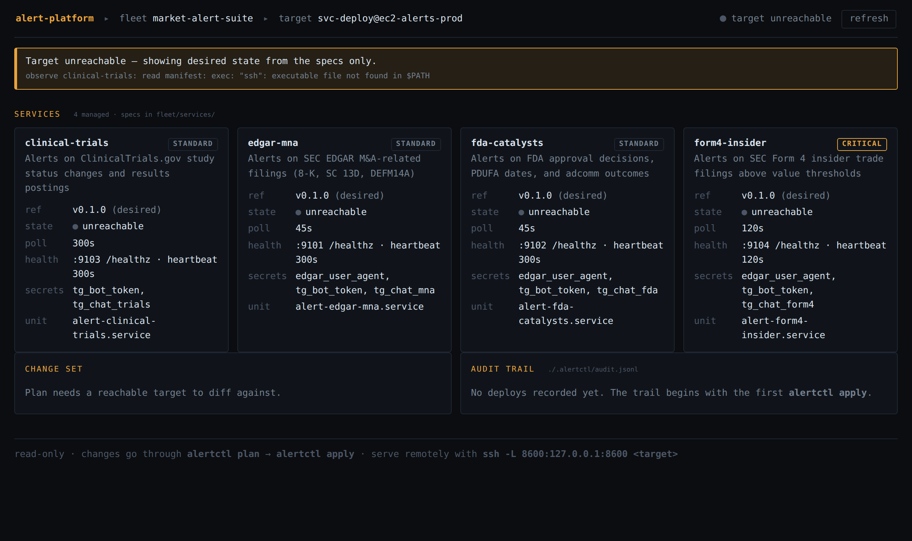

# Architecture

How the pieces fit, and why the seams are where they are.

## Two planes

Same diagram as text

    ┌──────────────────────────── control plane (Go) ──────────────────────────┐
    │                                                                          │
    │   fleet/fleet.yaml ─┐                                                     │
    │                     ├─> deep merge ─> effective config ─┬─> systemd unit  │
    │   fleet/services/*.yaml                                 └─> environment   │
    │                     │                                                     │
    │                     └─> tools/validate.py  (gate 1, shared with CI)       │
    │                                                                          │
    │   alertctl plan ──> observe host ──> diff ──> plan.json (fingerprinted)   │
    │   alertctl apply ─> gates ─> deploy ─> post-deploy gate ─> audit / rollback│
    └──────────────────────────────────────────────────────────────────────────┘
                                      │
                                      │  ssh + systemd
                                      ▼
    ┌───────────────────────────── data plane (Python) ────────────────────────┐
    │                                                                          │
    │   services/alertlib/   config · logging · state · delivery · health       │
    │        ▲        ▲          ▲            ▲                                 │
    │        │        │          │            │                                 │
    │   clinical_trials  edgar_mna  fda_catalysts  form4_insider                │
    │                                                                          │
    │   stdout (JSON) ─> journald        :91xx /healthz  /metrics               │
    └──────────────────────────────────────────────────────────────────────────┘

The control plane never contains business logic and the data plane never
contains deployment logic. The only thing crossing the boundary is an
environment contract, documented in `services/alertlib/config.py` and
rendered by `internal/engine/unit.go` — and tested from both sides by
`services/tests/test_contract.py`, because a contract nobody checks is a
comment.

## The environment contract

`alertctl` resolves the effective config, renders `/etc/alert-platform/<svc>.env`
(0640, root:svc-alerts), and systemd hands it to the process. The service
reads it through `Service.from_env()` and reads nothing else — no config
file, no `.env`, no hardcoded path.

| Source in the spec | Environment variable | Read by |
|---|---|---|
| `metadata.name` | `ALERT_SERVICE_NAME` | logging labels, state dir |
| `polling.interval_sec` | `ALERT_POLL_INTERVAL_SEC` | poll loop |
| `polling.<other>` | `ALERT_POLLING_<KEY>` | service-specific behaviour |
| `health.metrics.port` | `ALERT_METRICS_PORT` | health server |
| `health.heartbeat_interval_sec` | `ALERT_HEARTBEAT_INTERVAL_SEC` | liveness |
| `state.dir` + name | `ALERT_STATE_DIR` | SQLite location |
| `delivery.rate_limit_per_min` | `ALERT_RATE_LIMIT_PER_MIN` | Telegram bucket |
| `*_secret: <name>` | `ALERT_SECRET_<NAME>` | resolved value |
| `source.ref` | `ALERT_DEPLOYED_REF` | log and metric labels |

Adding a field is a three-line change: schema, `RenderEnv`, `ServiceConfig`.
The contract test then fails until all three agree, which is the point.

## Host layout

    /opt/alert-platform/<service>/
        releases/v0.1.0/          full repo checkout at the pinned tag
        releases/v0.1.1/          previous releases (3 kept)
        current -> releases/...   atomic symlink; WorkingDirectory
        deployed.json             manifest: ref, hashes, who, when, plan id
    /etc/alert-platform/<service>.env      resolved secrets, 0640
    /etc/systemd/system/alert-<service>.service
    /var/lib/alert-platform/<service>/     SQLite state, backed up
    /var/log/alert-platform/audit.jsonl    append-only deploy history

`current` is flipped with `ln -sfn` + `mv -Tf` so a restart can never observe
a half-swapped tree. Releases are pruned to three: enough to roll back
through a bad day, few enough not to fill the volume, and older tags are
always re-fetchable from the repo.

## Deploy lifecycle

1. **`plan`** — validate, resolve effective config, read `deployed.json` and
   `systemctl show` from the host, diff, fingerprint the result.
2. **Gate: validation** — `tools/validate.py`, the same command CI runs.
3. **Gate: freshness** — re-plan and compare fingerprints. A plan approved
   against different desired state is refused rather than applied.
4. **Gate: tag exists** — `git rev-parse` the ref before anything is touched.
5. **Deploy, one service at a time** — fetch tag, build venv, write env,
   write unit, flip `current`, `daemon-reload`, restart.
6. **Gate: post-deploy** — wait `startup_grace_sec`, require `active`, then
   poll `/healthz` until the heartbeat is fresh. A process that starts and
   then wedges fails this gate; a plain `systemctl` check would not notice.
7. **Audit** — one JSONL entry per service: actor, target, from/to ref,
   hashes, secret *names*, outcome, duration.
8. **Rollback on failure** — re-apply the previous ref, itself audited.

Standard-tier services deploy before critical-tier ones. If a shared change
is going to break something, it should break `clinical-trials` while the gate
can still stop the rollout, not `form4-insider`.

## Why rollback is boring

`source.ref` must be a semver tag (schema-enforced), so the previous spec
fully determines the previous code. Rollback is therefore an ordinary apply
of a different ref — same gates, same audit, same code path. There is no
rollback engine to be wrong, which is exactly what you want from the thing
that runs when everything else has already gone wrong.

`alertctl rollback` deliberately rewrites the spec rather than deploying
behind the repo's back. A rollback that skipped the spec would leave the repo
claiming a version that is not running, and the next apply would silently
roll forward again — reintroducing the outage.

## Failure modes and where they surface

| Failure | Detected by | Response |
|---|---|---|
| Bad spec | `validate` (local, CI, gate) | deploy refused |
| Missing tag | pre-flight `git rev-parse` | deploy refused |
| Stale plan | fingerprint mismatch | deploy refused |
| Missing secret | resolver, before restart | deploy refused |
| Service crash loop | post-deploy gate (`is-active`) | auto-rollback |
| Process up, loop wedged | post-deploy gate (`/healthz` 503) | auto-rollback |
| Manual edit on the host | `alertctl drift` | exit 3, alert |
| Stale control plane on the host | build stamp in `status` / `drift` | notice on the run; `plan` rebuilds |
| Upstream 502 in steady state | `alert_poll_errors_total` | dashboard, no page |
| Telegram rejecting sends | `AlertDeliveryFailing` rule | page |

The distinction in the last two rows is the one worth keeping: a polling
service that sees an upstream error is doing its job; a service that cannot
deliver is silently useless, which is worse than being obviously down.

## Which control plane answered

`alertctl` is built on the host from the host's own checkout, and only a
`plan` moves that checkout (§6). Every other verb runs whatever binary the
last `plan` produced, so a read can answer from a commit older than the one
the reader is looking at — and the answer looks the same either way. On
2026-09-22 a `drift` exit 0 was read as "production matches `main`" when it
meant "production matches the specs the host last synced".

So `status` and `drift` print, before their answer:

    control plane: alertctl d11b09b07288 (committed 2026-09-25T08:35:54Z)

The revision is not passed in at build time. The Go toolchain records
`vcs.revision`, `vcs.time` and `vcs.modified` in any binary built inside a
readable git checkout, and `internal/buildinfo` reads them back out of the
running binary — so this needs no change to how the host builds, which matters
because that build command lives in the wrapper. A build with no stamp says so
rather than printing nothing; a build from a modified tree says that too,
because a revision alone would then name a commit the binary is not.

The timestamp is the *commit's*, not the build's: `vcs.time` is the time
associated with `vcs.revision`. The two are close in practice — the host
rebuilds within a minute of a plan — but they are not the same claim, and the
first host reading showed the difference (binary built at 08:36:3x, stamp
reading 08:35:54Z).

`ssm-run` compares the revision against the commit the workflow was dispatched
from and annotates the run when they differ. It annotates rather than fails:
between a merge and the next `plan`, a host one commit behind is the normal
state, and a red X for a normal state is a red X nobody reads
([ADR 0002](adr/0002-exit-codes.md)).

This does not make `drift` a backstop against forgetting to deploy — `drift`
still compares against the host's checkout, not against `origin/main`. It
makes the gap visible, which is what turns an unnoticed stale answer into a
line in the run.

## The operator console

`alertctl serve` puts a read-only web view on the same engine the CLI drives.

It exists to answer the question a terminal answers badly — *what is the state
of the whole fleet right now* — and it is built under two constraints:

- **No second source of truth.** Every panel calls `fleet.Load`,
  `engine.Observe`, `engine.BuildPlan` or `audit.History`. There is no
  console-specific data model and nothing to keep in sync; if the console and
  the CLI ever disagree, one of them has a bug, which is a better failure mode
  than a cache that is quietly wrong.
- **No write path.** Non-`GET` methods are refused at the boundary, and no
  handler reaches mutating code. Changes go through `plan` → review →
  `apply`, where the confirmation prompt, the gates and the audit record
  live. A browser button that deploys would have to reproduce all of that, or
  quietly skip it.

It degrades in the direction that keeps it honest. Desired state comes from
the specs and renders with no target at all; observed state appears when the
host is reachable and turns into an explicit banner when it is not. The
console never draws a healthy-looking fleet it cannot see:

Note what the panels say rather than show. "Plan needs a reachable target to
diff against" is a different statement from an empty diff, and an empty audit
trail says where entries will come from. A dashboard that renders blank on
failure is indistinguishable from one reporting that nothing is wrong.

It binds to loopback and has no authentication, which is deliberate — for a
remote target, forward it over the transport the platform already trusts:

    ssh -L 8600:127.0.0.1:8600 ec2-alerts-prod

## Portability: what the platform actually assumes

The platform targets systemd over SSH and nothing narrower. It shells out to
`systemctl`, `journalctl`, `install`, `git` and `curl`; it writes unit files
to `/etc/systemd/system` and reads `systemctl show`. Nothing in the control
plane is Debian- or Ubuntu-specific: there are no `apt` calls, no
distribution-specific paths, and no assumptions about the init system beyond
systemd itself.

Moving the fleet to RHEL, or onto KVM guests rather than EC2 instances, is
therefore a change to `targets` in `fleet.yaml` and to
`defaults.runtime.interpreter` — not a change to the engine. The one thing
that would need attention is SELinux: RHEL enforces contexts on files under
`/etc/systemd/system` and `/opt`, so the unit and env writes would need
`restorecon` (or correct contexts at install time) added to the deploy steps.
That is a known, bounded addition to `applyService`, and it is called out here
rather than discovered later.

Virtualization is deliberately outside the platform's scope. `targets` names
hosts; how those hosts come to exist — EC2, KVM, bare metal — is a layer
below, and the platform is better for not having an opinion about it.

## Log and metric shipping

Services log JSON to stdout and systemd routes it to journald. That choice was
made with shipping in mind: journald is a single, structured, queryable source
that every log shipper already knows how to read, so attaching one is a host
concern rather than a service change.

Concretely, a Splunk universal forwarder or a Humio/Falcon LogScale shipper
reads the journal directly (or `journalctl -o json` piped to it) and gets
per-service structured fields — `service`, `level`, `event`, `ref` — without
any service being rebuilt, redeployed, or even restarted. The same is true in
reverse: the platform does not need to know which shipper is in use.

Metrics take the other path. Each service exposes `/metrics` on a port its own
spec declares, `tools/gen_observability.py` derives the scrape targets and
alert rules from those specs, and CI fails if the generated config has drifted
from them. Swapping Prometheus for another scraper means changing the
generator, not the services.

### The metrics snapshot

Nothing scrapes this fleet yet, and `/metrics` binds to the host's loopback.
The only read verb that returns host output is `logs`, so until a scraper
exists every cumulative counter is recorded where nobody outside the host can
read it — which is the opposite of the reason they were added. Four questions
sat unanswered on that: whether any alert has ever been delivered, whether the
archive is filling, how often a trial's status actually changes, and whether a
send has ever been refused.

So the poll loop writes the whole registry to the journal as one line, every
`METRICS_SNAPSHOT_INTERVAL_SEC` (900) and once more when the process stops:

    {"msg": "metrics snapshot", "metrics": {"alert_polls_total": 1890, ...}}

Three decisions in that, each with a reason a reviewer will ask for.

`alert_uptime_seconds` travels with it, because a counter without the window it
accumulated over is a number rather than a rate.

The values are nested under one key rather than flattened into the record. The
JSON formatter drops record attributes that collide with `logging.LogRecord`'s
own — a metric named `name` or `msg` would vanish silently, and a measurement
that disappears on a rename is not a measurement.

The cadence is a compromise between the same two constraints that shaped the
source-health schedule. A snapshot has to be frequent enough that a short
`logs` window contains one per service, and rare enough that it is not the
thing filling the 24 KB that window returns: a quarter hour is about 96 lines
a day per service. The shutdown snapshot exists because a deploy replaces the
process and its totals are not carried forward, so without it the outgoing
process's counts are simply lost.

The snapshot duplicates `/metrics` deliberately — the same numbers on a second
path — so a test asserts the two expose the same set of names. A counter that
reaches one and not the other would be a counter nobody can currently read.

### Source health is its own signal

A poll cycle can complete successfully while one of the sources it polls is
permanently broken, so the cycle counters cannot see the condition that matters
most to alert quality: a feed that stopped answering. `fda-catalysts` ran that
way from August to 2026-09-22 with two feeds returning 403 every cycle.

`alertlib.SourceHealth` keeps per-source outcome counts and the length of the
current failing run, and decides when a repeated failure is worth a log line:
the second consecutive one, then at widening intervals, then once when the
source is presumed dead, then once on recovery. It exposes
`alert_source_fetches_total`, `alert_source_fetch_failures_total`,
`alert_sources_failing` and `alert_sources_presumed_dead`. All four services
report through it.

The logging schedule is not cosmetic. An unconditional warning per failed fetch
costs about 1,900 lines per source per day at a 45-second cadence, and the
`logs` read verb captures roughly the first 24 KB of its window — so source
spam displaces the alert output an operator opened the log to read.

**A blip is not an outage, and the two need different instruments.** The
schedule starts at the second consecutive failure rather than the first, and a
failing run that never reached it recovers without a line. This is what a
source that flaps costs otherwise: measured on 2026-09-27, PRNewswire answered
`edgar-mna` with 404, 502, 503 and read timeouts roughly one cycle in five and
recovered immediately each time, while `fda-catalysts` produced the full
failed → summary → recovered → summary sequence twice for PRNewswire-Biotech
inside twenty-one minutes. Announced per event, a source that is 80% fine
out-logs one that is dead.

Nothing about the failure is lost, because the log was the wrong place to read
a rate from: `alert_source_fetch_failures_total` counts every attempt that
failed, blip or not, and reaches an operator through the metrics snapshot. The
journal reports conditions; the counters report rates.

### The candidate funnel

Source health answers "is the feed answering". It does not answer the question
`clinical-trials` raised: the feed answers, the service examines hundreds of
candidates a cycle, and nothing comes out. Only the two ends of that pipeline
were recorded, so a filter that is too tight, an upstream query returning the
same rows every cycle, and a transition observed one cycle too late all
produced identical output.

`alertlib.CycleFunnel` records the middle. A service declares the stages its
candidates pass through, counts each one during a cycle, and emits one line per
cycle naming every stage; each stage is also an `alert_funnel_<stage>_total`
counter on `/metrics`. Counting against an undeclared stage raises, because a
funnel that grows a stage on a typo renders a line that looks like a
measurement and is not one.

`alert_funnel_new_in_window` is the part that needs explaining. It compares
this cycle's candidate ids against the previous cycle's, which is the direct
test of a stuck upstream query. "New to our database" does not test it: a
candidate can be long known and still be a fresh arrival in the polling window.
Before any comparison exists the line reports `?` rather than `0`, since zero is
a real answer a later cycle can give.

`clinical-trials` is the first adopter, with `first_sight_completed` as a stage
chosen to test one specific explanation — see
[ADR 0006](adr/0006-candidate-funnel.md). Its `signals_industry` stage counts
signals whose lead sponsor the registry classes `INDUSTRY`, the sponsors that
usually have a listed equity; `signals` minus `signals_industry` is the share
from universities, hospitals and government. Each alert's title carries the
class (`TERMINATED [OTHER]: …`), so the alert digest shows it too.

`form4-insider` is the second, and its stages are shaped differently. Where
the trials funnel narrows a stream of candidates, this one has to say which of
five silences it is in: an empty feed, a feed of filings already handled, a
fetch that fails, a dedup write that refuses the send, or a filter that says
no. The last of those is a histogram rather than a single count —
`should_alert` returns the *name* of the branch it took, one of
`main.DECISIONS`, and the funnel counts that name. The decision and its
measurement are then the same value, so a new branch cannot be added without a
stage for it: counting against an undeclared stage raises. The distinction
that matters today is `no_leaderboard`, which says the alpha filter refused
because there is no leaderboard to compare against rather than because the
insider fell short.

Decisions are per transaction; alerts are per filing. One Form 4 can
report a single decision as many lines (on 2026-10-05 Berkshire Hathaway's LEN
purchases produced eight alerts in the same minute, one per line), so `group_trades` collapses the transactions that pass
into one buy and at most one sell per filing, with summed value and shares,
the volume-weighted price and the trade-date range. The decision stages
therefore sum to `transactions`, while `sent` counts alerts. The archive row
is keyed `<accession>#<P|S>`, its `reason` is the decision name, and its
payload lists the member transactions.

A fetch that fails is counted under one of `main.FETCH_FAILURES`:
`index_unavailable` (the filing's `index.json` request failed),
`no_form4_xml` (the index lists no candidate XML) or `xml_unavailable` (the
XML request failed). Each is also logged as `filing not fetched`, with the
HTTP status or exception type, or with the index listing for `no_form4_xml`.
The first and last may succeed on a retry. The middle one points at the
file-selection rule in `form4_backfill.fetch_filing_xml`.

Two stages bracket those. `not_form4` counts feed entries dropped before
`new` because their form type is neither `4` nor `4/A`: the feed URL's
`type=4` is a prefix match, so it can also carry 424B2, 497 and similar
filings. Each distinct dropped type is logged once per process as
`feed entry is not a Form 4`. An entry whose form type cannot be read is
kept. `unparsed` counts fetched XML that `parse_form4_xml` rejects, logged as
`filing not parsed` with the document's root element, which separates a
non-Form-4 document from a Form 4 the parser cannot read.

The leaderboard is scored by `form4_scorer.py` from daily closes fetched with
`form4_common.fetch_yahoo_closes` (Yahoo's v8 chart endpoint). At startup the
service fetches 30 days of SPY closes once and reports the result as
`price source probe` (HTTP status or exception name, and the number of
closes) and as the `alert_price_source_closes` gauge. A 0 there means the
scorer would score nothing.

The scorer runs inside `form4-insider`, after each poll cycle's filings, for
at most `SCORING_BUDGET_SEC` (20s of the 120s interval). It is a step in the
existing process rather than a timer unit, so it adds no unit, spec field or
deploy-lifecycle change, and a slow price source delays the next poll by at
most one request instead of stalling it. Only open-market buys (code `P`) are
scored, because only buys enter the leaderboard. A buy is due once its 90-day
close exists (trade date at least 95 days ago) and again at 180 days; younger
trades are not fetched. Each ticker tried is recorded in `score_attempts`, and
one that still has due buys (no prices, or history that starts after the
trade) waits 7 days before the next try. When a step finds nothing due and
anything changed since the last computation, including a process start, it
recomputes the leaderboard and the alpha cutoff. Without SPY closes nothing is
scored, and SPY is retried hourly. A step that raises is logged as
`scoring step failed` and counted; it never stops the alerter. A step that did
work logs `scoring step` with its counts, and the snapshot carries
`alert_scorer_tickers_due`, `alert_scorer_tickers_scored_total`,
`alert_scorer_tickers_no_prices_total` and `alert_scorer_errors_total`.

`edgar-mna` and `fda-catalysts` count every feed entry into one of
`unclassified`, `matched` (and, in `edgar-mna`, the `disclosure_noise` and
`letter_of_intent` title filters), then every match into `already_seen`,
`sent` or `send_failed`. They emit no per-cycle line and no
`new_in_window`: they cycle every 45 seconds over up to sixteen feeds on three
cadences, so a line per cycle would crowd the `logs` window and there is no
single cohort to compare. The counters reach the journal in the metrics
snapshot.

### The alert archive

Every alert is recorded before it is sent and settled with its delivery
outcome afterwards, in an append-only SQLite table in the service's own state
directory (`<state_dir>/alerts.db`). The row holds the service, the released
ref, the upstream source, the service's dedup key, the ticker, the reason the
filter fired, the message as sent, a JSON payload of structured detail, and
whether delivery succeeded.

This is what makes signal quality measurable. A journald line holds rendered
prose and rotates; a row holds the fields an analysis groups by and does not.
It is also what the operator console and the public site will read.

The archive is a separate database from the service's dedup state, and a
failed archive write is logged and counted rather than raised — the reasoning
for both, and why they point in opposite directions, is in
[ADR 0005](adr/0005-alert-archive.md). It exposes
`alert_archive_records_total`, the rows in the file (seeded from it at start, so
it survives restarts), and `alert_archive_write_failures_total`.

Services reach it through `Service.send_alert`, not by calling the archive and
the Telegram client in sequence, so "every alert is recorded" is a property of
the send path rather than a convention four services have to remember.
`alert_alerts_sent_total` is counted there too, so it counts delivered alerts
only; the startup and crash messages go to Telegram directly and are neither
archived nor counted.

No read verb can query the archive yet, so its contents leave the host the
same way the counters do. With every metrics snapshot each service writes an
`alert digest` line covering the last 24 hours:

    {"msg": "alert digest", "digest": {"since": "...", "total": 38,
      "by_reason": {"large_trade": 38}, "by_delivery": {"sent": 38},
      "alerts": ["10-06T01:47Z ACCV [large_trade] ACCV P $3,600,000 by ...", ...]}}

The counts cover the whole window; the list is the newest 25, titles cut to
80 characters, so the line stays near 3 KB against the ~24 KB `logs` returns.
The digest opens the database in `mode=rw`, which fails rather than creating
the file, so a service that has never alerted still has no `alerts.db` and
reports a total of 0. A failed digest is logged once per interval and costs
nothing else.

## What is still deliberately absent

- **Multi-host scheduling.** `targets` models one EC2 host. The shape leaves
  room; nothing pretends to be a scheduler.
- **A queue between detection and delivery.** Alerts are sent inline. At this
  volume a queue would add a failure mode without removing one.
- **Config templating.** Four services do not justify a template layer, and
  the reviewability of a plain YAML diff is a feature.
- **Secrets in the control plane.** Values are resolved on the host, by the
  host's own instance role. The operator's terminal never sees them.
